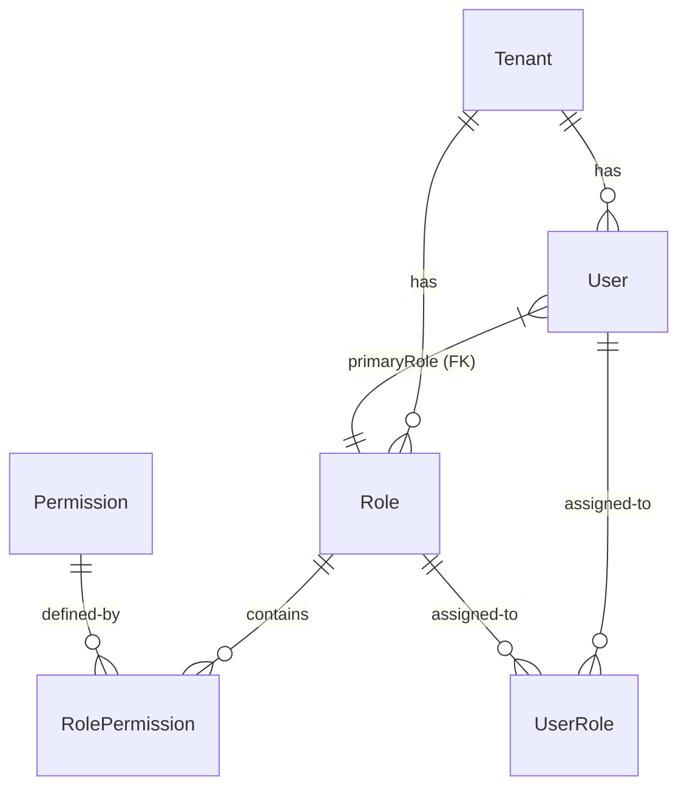

# Role-Based Access Control (RBAC) & Validation Status

This document provides a comprehensive overview of the status of the **Role-Based Access Control (RBAC)** implementation and request/payload validation in the **Central Kitchen Management** system.

---

## 1. Executive Summary

- **RBAC Status**: **Fully Seeded & Middlewared** but partially integrated on the routing level.
  - The database schema is fully equipped to support multi-tenant, multi-role (including multi-role per restaurant branch), and granular permission checks.
  - Seeding scripts correctly define system role templates and tenant-specific copies (e.g., `SUPER_ADMIN`, `KITCHEN_MANAGER`, `RESTAURANT_ADMIN`, etc.).
  - Global `authMiddleware` and permissions check middleware `requirePermission` exist in [rbac.middleware.ts](file:///home/ubuntu/Downloads/Central-Kitchen-Management/backend/src/middlewares/rbac.middleware.ts).
  - Routes like `/admin` and `/restaurant` currently use `authMiddleware` but have **not** fully integrated granular `requirePermission` middlewares at the endpoint level yet. The route stubs for role/user configurations are still pending full implementation.
- **Validation Status**: **Fully Operational** for authentication endpoints.
  - Request validation uses **Zod schemas** in [validation.ts](file:///home/ubuntu/Downloads/Central-Kitchen-Management/backend/src/utils/validation.ts).
  - Schema covers signup, login (password-based and OTP-based), tenant resolution, and password resets.
  - Controllers validate requests at entry points using `.parse(req.body)`.

---

## 2. Database Schema (Prisma)

The database design uses a multi-tenant-friendly RBAC schema where permissions are modularized.

### Core Models for RBAC
1. **`Role`**: Represents a designation (e.g., `SUPER_ADMIN`, `KITCHEN_MANAGER`, `RESTAURANT_ADMIN`).
   - `tenant_id`: Nullable for system role templates; otherwise, bound to a specific Central Kitchen (CK) tenant.
   - `code`: Two-digit system identifier (e.g., `01` for Super Admin, `02` for Kitchen Manager, `50` for Restaurant Admin).
   - `type`: Either `central_kitchen` or `restaurant`.
2. **`Permission`**: Granular operations categorized by `module` and `action` (with a unique `code` tag).
3. **`RolePermission`**: Junction table mapping roles to multiple permissions.
4. **`User`**: Bound to a tenant. Holds a `primary_role_id` referencing a `Role`.
5. **`UserRole`**: Supporting multiple roles per user at the CK tenant level.
6. **`RestaurantUserRole`**: Junction supporting multiple roles for a single user at a specific restaurant branch (e.g., a user holding `Restaurant Manager` + `Billing Approver`).

---

## 3. RBAC Implementation Details

### A. Seeding & Role Creation
- **System Role Templates**: Seeded with `tenant_id: null` in [seed.ts](file:///home/ubuntu/Downloads/Central-Kitchen-Management/backend/prisma/seed.ts).
- **Tenant Onboarding**: When a tenant registers (via `/auth/signup` or through administrative utilities), the `seedTenantRoles` service duplicates the system roles for that specific tenant.
- **Primary Roles & Junction Records**: Upon user creation, their role is mapped both as `primary_role_id` and inside the `UserRole` junction table.

### B. Middleware Flow
1. **Authentication (`authMiddleware`)**:
   - Decodes JWT access token.
   - Queries database for the user, eagerly loading `primaryRole` along with its associated `RolePermission` and `Permission` records.
   - Rejects inactive or deleted users.
   - Populates `req.user` and `req.tenantId` for subsequent middlewares.
2. **Permission Guard (`requirePermission(module, action)`)**:
   - Allows Super Admins (`SUPER_ADMIN` name, role code `01`, or system super admin) to bypass permission checks.
   - Scans `req.user.primaryRole.role_permissions` to ensure a match for the specified `module` and `action`.
   - Returns `403 Forbidden` if the user lacks the required permission.

---

## 4. Input & Request Validation (Zod)

Payload validation is concentrated in [validation.ts](file:///home/ubuntu/Downloads/Central-Kitchen-Management/backend/src/utils/validation.ts). It enforces structural constraints, string lengths, and email patterns before business logic executes.

### Currently Implemented Schemas:
| Schema Name | Target Endpoint | Key Validations |
| :--- | :--- | :--- |
| `signupSchema` | `POST /auth/signup` | Strong checks for name, email, mobile (min 10 digits), password (min 6 chars) |
| `loginSchema` | `POST /auth/login` | Coerces `tenant_id` to number, ensures credentials are provided |
| `sendOtpSchema` | `POST /auth/send-otp` | Validates custom enum purposes (`login`, `email_verify`, `password_reset`, `verify_mobile`) |
| `verifyOtpSchema` | `POST /auth/verify-otp` | Enforces exact 6-digit numeric OTP string format |
| `resetPasswordOtpSchema` | `POST /auth/reset-password` | Combined OTP and password validation |
| `loginOtpSendSchema` & `loginOtpVerifySchema` | `POST /auth/login-otp/*` | Validates mobile/email and 6-digit verification code |

---

## 5. What Remains to Be Done (Next Steps)

1. **Populate Granular Permissions**: Create individual `Permission` records in the database (e.g. `module: 'inventory', action: 'read'`) and map them to standard roles.
2. **Apply Route-Level Guards**: Apply the `requirePermission` middleware on the admin routes in [admin.routes.ts](file:///home/ubuntu/Downloads/Central-Kitchen-Management/backend/src/routes/admin.routes.ts) and other entity routes.
3. **Implement Core Route Stubs**: Complete the controller logic and routes inside [role.routes.ts](file:///home/ubuntu/Downloads/Central-Kitchen-Management/backend/src/routes/role.routes.ts) and [user.routes.ts](file:///home/ubuntu/Downloads/Central-Kitchen-Management/backend/src/routes/user.routes.ts).
